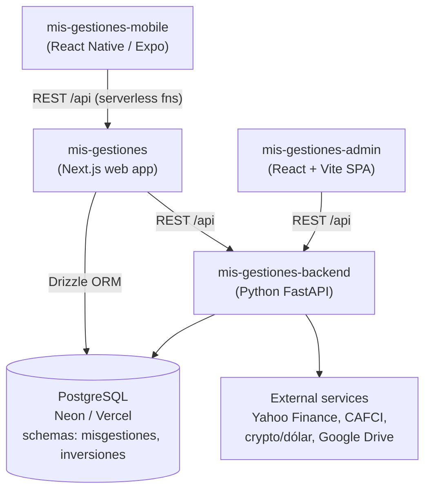
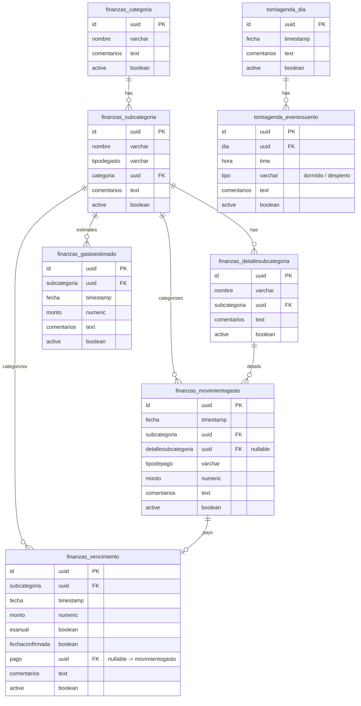
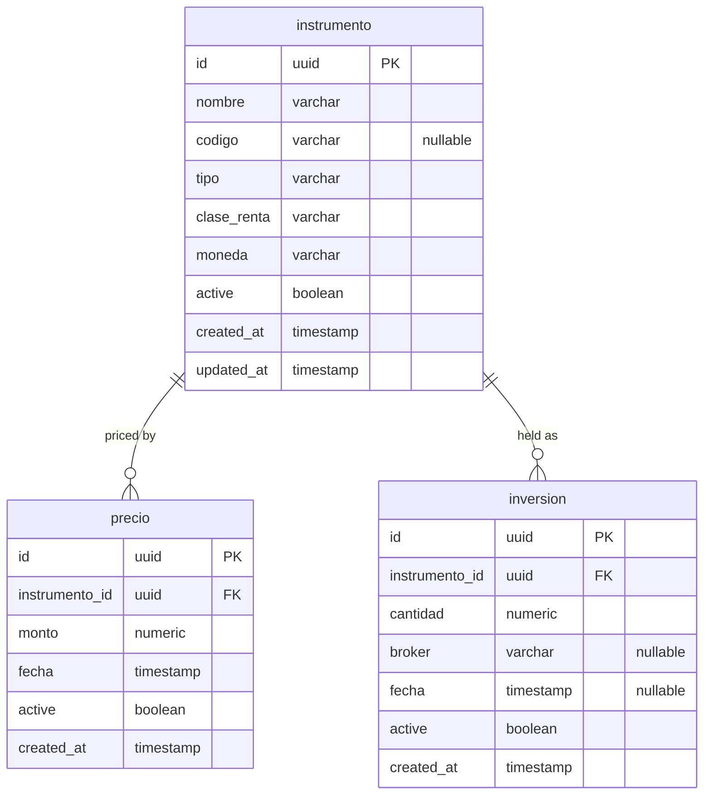

# Mis Gestiones — Ecosystem Overview

A personal finance, investment, and household-tracking system spread across four
repositories. This document summarizes what each repo does, its main
technologies, and how they fit together.

> Domain language is Spanish throughout (e.g. *movimiento*, *concepto*,
> *vencimiento*, *inversión*, *instrumento*, *cotización*).

## The four repositories

| Repo | Role | Stack | Deployed to |
|------|------|-------|-------------|
| `mis-gestiones-backend` | Core REST API + market data + Drive | Python 3.13, FastAPI, SQLAlchemy, PostgreSQL | Vercel (`mis-gestiones-backend.vercel.app`) |
| `mis-gestiones` | Main web app (UI + its own serverless API + direct DB) | Next.js 16, React 19, MUI, Drizzle ORM, Neon Postgres | Vercel (`mis-gestiones-opal-kappa.vercel.app`) |
| `mis-gestiones-admin` | Admin SPA for master data | React 19, Vite, MUI, React Query | Vercel (`mis-gestiones-admin.vercel.app`) |
| `mis-gestiones-mobile` | Mobile app (expenses + sleep tracking) | React Native, Expo SDK 54, TypeScript | EAS build (Android APK) |

---

## `mis-gestiones-backend` — Core API

The central REST API and the ecosystem's connection to external market data.

- **Purpose:** Exposes finances (categorías, subcategorías, movimientos de gasto,
  vencimientos), investments (instrumentos, precios, inversiones), market quotes
  (dólar, crypto, FCI mutual funds, US/AR tickers), and Google Drive file storage
  for receipts (comprobantes).
- **Technologies:** Python 3.13, FastAPI + Uvicorn, SQLAlchemy 2.x ORM over
  PostgreSQL (`psycopg2`), schemas `misgestiones` and `inversiones`. External
  integrations via `yfinance` (Yahoo Finance), CAFCI, crypto/exchange services,
  and `google-api-python-client` (Drive).
- **Key endpoint groups** (under `/api`): `finanzas`, `inversiones`,
  `cotizaciones`, `drive` (Drive routes are API-key protected via
  `BACKEND_SHARED_SECRET`).
- **Notable:** CORS whitelists the admin and web-app origins. The README is an
  unmodified Vercel boilerplate template — the real behavior lives in the code.

## `mis-gestiones` — Web app

The primary interface, and the most architecturally layered repo of the four.

- **Purpose:** Full web UI for finances (buscar movimientos, movimientos del mes,
  presupuesto del mes, vencimientos, importar), inversiones, and the personal
  *tomi* module (agenda / sleep tracking). Includes settings screens that embed
  the backend API docs and the admin app via iframes.
- **Technologies:** Next.js 16 (App Router, Turbopack), React 19, TypeScript,
  MUI 6 + MUI X (charts, data-grid, date-pickers), Tailwind, TanStack Query.
  Data access via Drizzle ORM against Neon serverless Postgres.
- **Three data paths:**
  1. Calls the Python **backend** over HTTP (`NEXT_PUBLIC_BACKEND_BASE_URL`) for
     movimientos-gasto and inversiones.
  2. Its own **Vercel serverless functions** in `/api` (`movimientos`,
     `conceptos-movimientos`, `subcategoria`, `agenda-tomi/dias`,
     `finanzas/movimiento-update`) — with permissive CORS, consumed by the mobile app.
  3. **Direct database access** to Neon Postgres via Drizzle (`src/lib/orm`).

## `mis-gestiones-admin` — Admin SPA

A focused single-page app for managing master/reference data.

- **Purpose:** CRUD for categorías + nested subcategorías (soft-delete, sorting,
  pagination) and financial instrumentos (stocks, bonds, ETFs, crypto, FCI) with
  live price quotes. Pure frontend — no backend code of its own.
- **Technologies:** React 19 + Vite 7 (React Compiler), TypeScript, MUI 7 +
  `material-react-table`, React Router 7, Axios, TanStack Query,
  React Hook Form + Zod.
- **Connection:** A single Axios client points at the Python backend
  (`VITE_BACKEND_API` → `mis-gestiones-backend.vercel.app/api`).

## `mis-gestiones-mobile` — Mobile app

The on-the-go companion for the most frequent daily entries.

- **Purpose:** Expense tracking (finanzas) and *tomi* sleep-schedule tracking on
  the phone, with optimistic local state and batch save.
- **Technologies:** React Native 0.81, Expo SDK 54 (Expo Router, Hermes / New
  Architecture), TypeScript. No global store — local `useState` with optimistic
  updates. Android package `com.andresaste.misgestionesmobile`.
- **Connection:** Talks to the **web app's** serverless API
  (`mis-gestiones-opal-kappa.vercel.app/api`), using endpoints such as
  `/movimientos`, `/conceptos-movimientos`, `/agenda-tomi/dias`, and
  `/finanzas/movimiento-update`.

---

## How the repos relate

Key relationships:

- **Shared database.** The Python backend (SQLAlchemy/`psycopg2`) and the Next.js
  web app (Drizzle) both read/write the **same** Neon/Vercel Postgres, across the
  `misgestiones` and `inversiones` schemas. This is the strongest coupling in the
  system.
- **Two API surfaces.** The Python `backend` is the primary REST API (used by the
  admin SPA and the web app). The web app *also* exposes its own Vercel
  serverless functions under `/api`, and those are what the **mobile** app calls —
  the mobile app does not talk to the Python backend directly.
- **Admin feeds the master data.** `admin` maintains categorías and instrumentos
  that the web and mobile apps then use when recording movimientos and inversiones.
- **No shared code / monorepo.** Integration is entirely over HTTP and the shared
  database; there are no shared packages linking the repos.

### Client → API summary

| Client | Talks to | Via |
|--------|----------|-----|
| `mis-gestiones-admin` | `mis-gestiones-backend` | Axios REST (`VITE_BACKEND_API`) |
| `mis-gestiones` (web) | `mis-gestiones-backend` + its own serverless API + Neon DB | Axios REST, Next API routes, Drizzle |
| `mis-gestiones-mobile` | `mis-gestiones` serverless API | `expo/fetch` REST |
| `mis-gestiones-backend` | PostgreSQL + external market/Drive services | SQLAlchemy, HTTP APIs |

---

## Database schema

The shared Postgres database is split into two schemas. They are independent —
there are no foreign keys crossing between them. The backend (SQLAlchemy) and the
web app (Drizzle) map to the same tables; a few `misgestiones` tables
(`finanzas_gastoestimado`, `tomiagenda_dia`, `tomiagenda_eventosuenio`) exist only
in the web app's Drizzle schema.

> All primary keys are `uuid`. `active` is a soft-delete flag present on every
> table. Column names are the physical (lowercase) names as stored in Postgres.

### Schema `misgestiones` — finances + *tomi*

### Schema `inversiones` — investments

